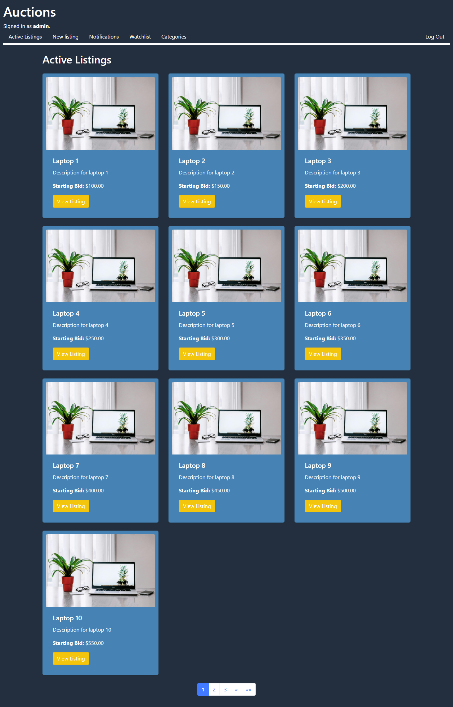
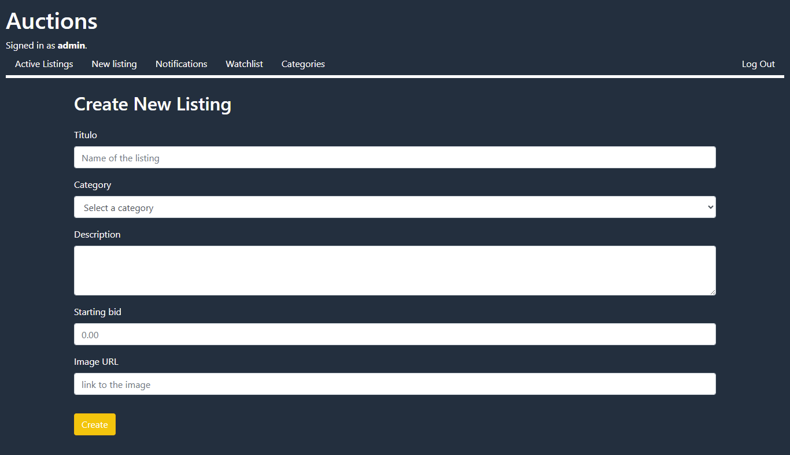
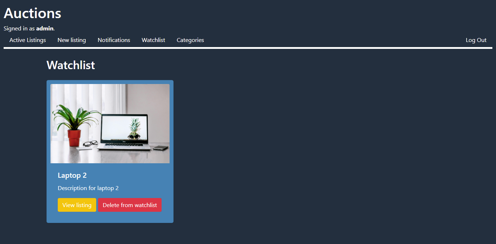

# 🛒 Commerce Web50 — Solución del Proyecto CS50W

Bienvenido a **Commerce Web50**, una implementación completa del proyecto de subastas en línea tipo eBay, desarrollado como parte del curso **CS50’s Web Programming with Python and JavaScript**. Esta solución está construida con **Django** y cumple con todos los requisitos establecidos por el proyecto original.

---

## 📸 Capturas de Pantalla

* **Listados Activos**
  

* **Crear Nuevo Listado**
  

* **Ver Listado**
  

* **Lista de Seguimiento**
  

---

## 🧾 Descripción General

Esta plataforma permite a los usuarios:

* Publicar subastas con título, descripción, precio inicial, imagen y categoría.
* Hacer ofertas en tiempo real que superen la anterior.
* Comentar en los anuncios.
* Agregar listados a una lista de seguimiento personal.
* Cerrar subastas y notificar automáticamente al ganador.
* Recibir notificaciones relevantes dentro del sistema.
* Filtrar y explorar subastas activas por categorías.

---

## ⚙️ Configuración del Proyecto

### 1. Clonar el repositorio

```bash
git clone https://github.com/Wesleykyle2005/Commerce-Web50.git
cd Commerce-Web50
```

### 2. Instalar dependencias

```bash
pip install django
```

### 3. Migrar la base de datos

```bash
python manage.py makemigrations
python manage.py migrate
```

### 4. Insertar datos de prueba

```bash
python make_insertions.py
```

Este script genera:

* 30 usuarios
* 30 categorías
* 30 listados con ofertas y comentarios predefinidos
* Superusuario:

  * **Usuario:** `Admin1234`
  * **Contraseña:** `Admin1234`

### 5. Ejecutar el servidor

```bash
python manage.py runserver
```

Accede a través de: [http://127.0.0.1:8000](http://127.0.0.1:8000)

---

## 📐 Detalles de Implementación

* **Modelos personalizados:**

  * Usuario (`AbstractUser`), Subasta, Oferta, Comentario, Categoría.

* **Formulario de creación de subasta:**

  * Permite definir campos como título, descripción, imagen (opcional) y categoría (opcional).

* **Listados activos:**

  * Página principal que muestra las subastas en curso.

* **Vista de subasta:**

  * Ofertar, comentar, agregar/eliminar de la watchlist, cerrar la subasta.

* **Lista de seguimiento (Watchlist):**

  * Vista personalizada por usuario para seguir listados de interés.

* **Navegación por categorías:**

  * Permite filtrar subastas activas según su categoría.

* **Panel administrativo:**

  * Gestión completa a través de `/admin` con el superusuario.

---

## 🛠️ Consideraciones Técnicas

* Las rutas sensibles están protegidas con `@login_required`.
* El sistema de notificaciones se integra con los modelos de usuario.
* Paginación incluida para mejorar rendimiento en grandes volúmenes de datos.
* Uso de clases heredadas de Django para mantener el proyecto escalable y mantenible.

---

## 🔗 Accesos Rápidos

* **Panel de administración:**
  [http://127.0.0.1:8000/admin](http://127.0.0.1:8000/admin)
  Usa las credenciales del superusuario creadas anteriormente.

* **Funcionalidades destacadas:**

  * Usuarios registrados pueden crear, ofertar y cerrar subastas.
  * Las ofertas solo son válidas si superan la oferta más alta.
  * Las notificaciones se muestran en la barra de navegación.
  * Los usuarios pueden seguir y dejar de seguir listados.
  * Solo el creador puede cerrar su subasta manualmente.
